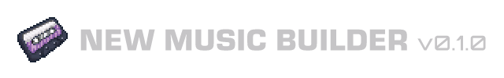

# New Music Builder

New Music Builder is the builder software for [Tali's New Music](https://steamcommunity.com/sharedfiles/filedetails/?id=3739256725).

It is made to help Project Zomboid modders create multitrack music media quickly and cleanly, with less manual setup and less trial-and-error during export.

## What It Does

New Music Builder helps you assemble workshop-ready music packs with:

- multitrack cassette, vinyl, and CD media setup
- cover and appearance selection
- audio conversion and compression
- preview and organization tools while authoring
- export into Project Zomboid mod/workshop folder structure

## About the App

Use this if you want to build custom music media for Tali's New Music in Project Zomboid without hand-authoring all of the supporting files yourself.
Created specifically for media packs where multiple tracks and media appearances need to be managed together.

## Platform Support

- Windows is the main packaged release target.
- Linux and macOS are expected to run from source with Python 3.12+.
- The codebase tries to stay cross-platform where practical, but Windows is still the primary supported release environment.

## Current State

- Song pack export is working end to end.
- Covers, compression, naming, organization, Lua/bootstrap output, and texture export are in place.
- The project is currently in cleanup and release-shaping mode rather than major feature churn.

## Run From Source

```powershell
python -m venv .venv
.\.venv\Scripts\Activate.ps1
pip install -r requirements.txt
python main.py
```

## Validate

```powershell
python -m compileall src
pytest -q
```

## Repo Notes

- `src/new_music_builder/` contains the application code.
- `assets/` contains runtime assets used by the builder.
- `tests/` contains automated validation coverage.
- `workspace/` and `logs/` contain local app state and log output defaults.
- `_references/` is kept out of Git and is not part of the public source distribution.
