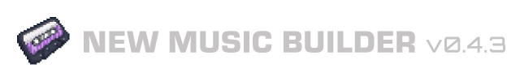

# New Music Builder

New Music Builder is the builder software for [Tali's New Music](https://steamcommunity.com/sharedfiles/filedetails/?id=3739256725).

It is made to help Project Zomboid modders create multitrack music media quickly and cleanly, with less manual setup and less trial-and-error during export.

## What It Does

New Music Builder helps you assemble workshop-ready music packs with:

- multitrack cassette, vinyl, and CD media setup
- row-based media authoring with expand/collapse, drag/reorder, and per-row song management
- cover and appearance selection across cassette, case, vinyl, jacket, and CD cover assets
- automatic cover-driven texture generation for cassette, case, vinyl, jacket, and CD cover outputs
- audio conversion and compression
- preview and organization tools while authoring
- workshop poster preview and export support
- export into Project Zomboid mod/workshop folder structure

## About the App

Use this if you want to build custom music media for Tali's New Music in Project Zomboid without hand-authoring all of the supporting files yourself.
Created specifically for media packs where multiple tracks and media appearances need to be managed together.

## Version

Current version: `0.4.3`

This is the `0.4.3` recovery line focused on keeping the stable `0.4.0` packaging spine while restoring safe export fixes for current builder projects.

Highlights:

- restored a true flat Singles export contract so cassette, vinyl, and CD singles insert and play correctly
- deduped Singles sound definitions while keeping the simpler legacy-safe runtime shape
- shortened Windows staging paths and added a friendlier path-length failure before export scaffolding breaks
- kept the proven `0.4.0` packaged runtime layout in place while this recovery line stabilizes

## Platform Support

- Windows is the main packaged release target.
- Linux and macOS are expected to run from source with Python 3.12+.
- The codebase tries to stay cross-platform where practical, but Windows is still the primary supported release environment.

## Current State

- Song pack export is working end to end.
- Automatic texture generation is in place for cassette, case, vinyl, jacket, and CD cover media.
- Covers, compression, naming, organization, Lua/bootstrap output, workshop poster output, and texture export are in place.
- The project is in cleanup, smoothness, and release-shaping mode rather than broad feature churn.

## Run From Source

### Linux / macOS

Run these commands from the repo folder:

```bash
python3.12 -m venv .venv
source .venv/bin/activate
pip install -r requirements.txt
python main.py
```

If `python3.12` is not installed, use your system package manager first.

If `tkinter` is missing, install your distro's Tk package and try again.

### Windows

Run these commands from the repo folder:

```powershell
python -m venv .venv
.\.venv\Scripts\Activate.ps1
pip install -r requirements.txt
python main.py
```

If double-clicking `main.py` just flashes and closes, use `Launch New Music Builder.bat` instead so startup errors stay visible.

## Repo Notes

- `src/new_music_builder/` contains the application code.
- `assets/` contains runtime assets used by the builder.
- `workspace/`, `logs/`, and `Generated Textures/` are source-run runtime/state locations and should not be treated as source content.
- automated tests and Windows packaging scripts live in the separate `New Music Builder - Dev Tools` workspace.
- `_references/` is kept out of Git and is not part of the public source distribution.

## Copyright and License

Copyright © 2026 Talismon. All rights reserved.

This repository is published to establish authorship and development history.
No part of this project may be copied, redistributed, reuploaded, modified for release, or incorporated into another application, mod, tool, or project without explicit written permission.

See [LICENSE.md](LICENSE.md) for full terms.
