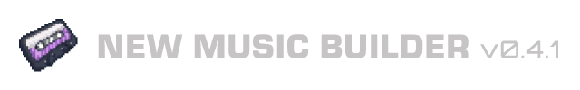

# New Music Builder

New Music Builder is the builder software for [Tali's New Music](https://steamcommunity.com/sharedfiles/filedetails/?id=3739256725).

It is made to help Project Zomboid modders create multitrack music media quickly and cleanly, with less manual setup and less trial-and-error during export.

## What It Does

New Music Builder helps you assemble workshop-ready music packs with:

- multitrack cassette, vinyl, and CD media setup
- row-based media authoring with expand/collapse, drag/reorder, and per-row song management
- cover and appearance selection across cassette, case, vinyl, jacket, and CD cover assets
- automatic cover-driven texture generation for cassette, case, vinyl, jacket, and CD cover outputs
- audio conversion and compression
- preview and organization tools while authoring
- workshop poster preview and export support
- export into Project Zomboid mod/workshop folder structure

## About the App

Use this if you want to build custom music media for Tali's New Music in Project Zomboid without hand-authoring all of the supporting files yourself.
Created specifically for media packs where multiple tracks and media appearances need to be managed together.

## Version

Current version: `0.4.0`

This is the `0.4.0` release focused on scaling mixed `Mixtape` and `Singles` packs cleanly, preserving fast export behavior on very large libraries, and stabilizing the export queue and generated preview flow for 1000+ song builds.

Highlights:

- streamlined Module 2, Module 4, and Module 5 behavior for large packs
- faster export throughput with bounded simultaneous conversion and calmer live logging
- improved `.ogg` passthrough and abort responsiveness during heavy builds
- moved Legacy Mode from a global project toggle to a per-row `Mixtape` / `Singles` switch
- added clean mixed-pack support so both row types can live in the same export

## Platform Support

- Windows is the main packaged release target.
- Linux and macOS are expected to run from source with Python 3.12+.
- The codebase tries to stay cross-platform where practical, but Windows is still the primary supported release environment.

## Windows Packaged Release Notes

The Windows download is an unsigned packaged Python desktop app.

That means some antivirus tools may show heuristic warnings for the release even when the bundle is clean, because the app ships with Python runtime files, native DLLs, and application assets together.

To reduce false positives, the packaged release is kept as static as possible:

- runtime state is created on first launch under `%LOCALAPPDATA%\NewMusicBuilder`
- the shipped app folder is kept focused on the executable and required runtime files
- unnecessary packaging leftovers are pruned from the release zip

If you are cautious about packaged executables, the source/manual-run path below remains available.

## Current State

- Song pack export is working end to end.
- Automatic texture generation is in place for cassette, case, vinyl, jacket, and CD cover media.
- Covers, compression, naming, organization, Lua/bootstrap output, workshop poster output, and texture export are in place.
- The project is in cleanup, smoothness, and release-shaping mode rather than broad feature churn.

## Run From Source

```bash
python3.12 -m venv .venv
source .venv/bin/activate
pip install -r requirements.txt
python main.py
```

On Windows, run from source manually:

```powershell
python -m venv .venv
.\.venv\Scripts\Activate.ps1
pip install -r requirements.txt
python main.py
```

If double-clicking `main.py` just flashes and closes, use [Launch New Music Builder.bat](<c:\Users\chowl\Zomboid\Workshop\New Music Builder\Launch New Music Builder.bat>) instead so startup errors stay visible.

## Repo Notes

- `src/new_music_builder/` contains the application code.
- `assets/` contains runtime assets used by the builder.
- `workspace/`, `logs/`, and `Generated Textures/` are source-run runtime/state locations and should not be treated as source content.
- packaged Windows releases create runtime state under `%LOCALAPPDATA%\NewMusicBuilder`.
- `_references/` is kept out of Git and is not part of the public source distribution.

## Copyright and License

Copyright © 2026 Talismon. All rights reserved.

This repository is published to establish authorship and development history.
No part of this project may be copied, redistributed, reuploaded, modified for release, or incorporated into another application, mod, tool, or project without explicit written permission.

See [LICENSE.md](LICENSE.md) for full terms.
